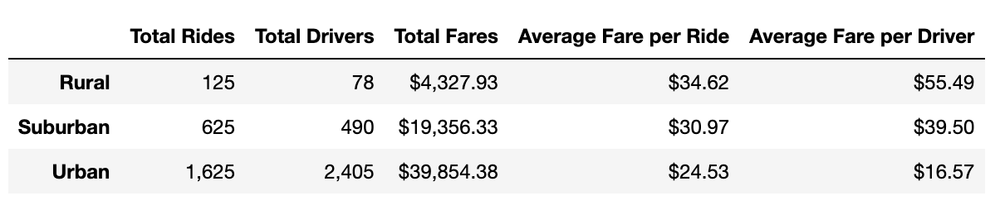
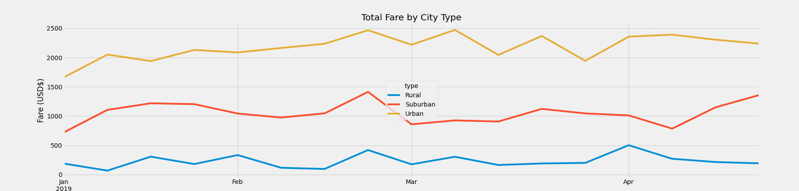

# PyBer-Analysis
Analyze all the Pyber rideshare data and create a compelling visualization with Matplotlib
## Overview
As a newly hired data analyst for Pyber, a Rideshare company, I am going to perform exploratory analysis on data that is stored in many .csv files. Pyber Rideshare company has been doing research on their ride-sharing data from the first quarter of 2019. Python, Jupyter Notebook, and Matplotlib were all used to create visualizations to better share the findings on the relationship between the type of city (urban, suburban, or rural) and the number of drivers and riders. In addition, I examined the percentage of total fares, riders, and drivers by city type. Finally, a summary DataFrame of the ride-sharing data by city type and a multiple-line graph portraying the total weekly fares for each city type were generated.
## Results
- The PyBer summary DataFrame includes: Total Rides, Total Drivers, Total Fares, Average Fare per Ride, and Average Fare per Driver. 
- The Total Rides, Total Drivers, and Total Fares were obtained by creating a Series by passing the DataFrame through the groupby() function two times. This creates a series of objects so I can pass the series into a new DataFrame. Code is shown below:
```
total_rides = pyber_data_df.groupby(["type"]).count()["ride_id"]
total_rides
type
Rural        125
Suburban     625
Urban       1625
Name: ride_id, dtype: int64
```
```
total_drivers = city_data_df.groupby(["type"]).sum()["driver_count"]
total_drivers
type
Rural         78
Suburban     490
Urban       2405
Name: driver_count, dtype: int64
```
```
total_fares = pyber_data_df.groupby(["type"]).sum()["fare"]
total_fares
type
Rural        4327.93
Suburban    19356.33
Urban       39854.38
Name: fare, dtype: float64
```
- The Average Fare per Ride and the Average Fare by Driver were found by dividing the previously created variables. Code is shown below:
``` 
avg_fare_per_ride = total_fares / total_rides
avg_fare_per_ride
type
Rural       34.623440
Suburban    30.970128
Urban       24.525772
dtype: float64
```
```
avg_fare_per_driver = total_fares / total_drivers
avg_fare_per_driver
type
Rural       55.486282
Suburban    39.502714
Urban       16.571468
dtype: float64
```
### The PyBer Summary DataFrame

- Urban cities had by far the most total rides, drivers, and fares. PyBer drivers in Urban cities make significantly less than other types of cities. This can be explained by the oversaturation of drivers. There were not even enough rides within the first quarter of 2019 for each driver to get at least one drive. The average fare ride for urban cities is also much lower than the other cities, which could be due to smaller distances between drop-off points in urban cities where many people are able to walk from place to place.
- The total rides, drivers, and fares in Suburban cities are all lower than in Urban cities but more than Rural cities. The distances between drop-off points in Suburban cities is slightly more than in Urban cities. This difference is depicted in the average fare per ride. The Suburban driver count is only about 20% of the Urban driver count but there is only a $20,000 difference in total fares between the two types of cities, which is half of the total fares generated by urban cities.
- For Rural cities, the total rides, total drivers, and total fares metrics are noticeably lower than both urban and suburban cities. This is likely because these cities are less populated. However, the average fare per ride and average fare per driver is undoubtedly higher. The distance between drop-off points is a definite factor in the higher averager fare per driver and ride. These increased distances increase the fares of the drives, and as a result the smaller number of drivers have a much higher average fare per driver.
### The PyBer Fare Summary Line Graph

*The above chart illustrates the weekly values by city type, starting in January 2019.*
## Summary
- PyBer would likely benefit from increasing their marketing budget so they have more customers. The market is so oversauturated that many of the drivers are not receiving work, thus gaining more riders should be a priority.
- Putting a freeze on the hiring of new employees in Urban cities until the customer base is more proportionate to the number of available drivers could increase profits as well. Each driver needs to have a minimum of 1 ride during each quarter.
- It would be helpful to collect additionaly data on Rural cities. It could provide insight on why the fares are consistently so low or why there seems to be little to no demand for ride-share services.
